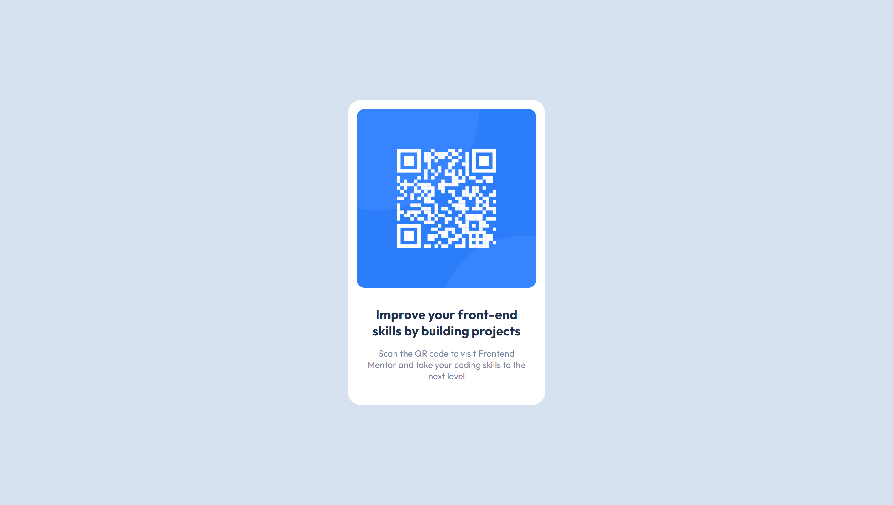

# Frontend Mentor - QR code component solution

This is a solution to the [QR code component challenge on Frontend Mentor](https://www.frontendmentor.io/challenges/qr-code-component-iux_sIO_H). Frontend Mentor challenges help you improve your coding skills by building realistic projects.

## Table of contents

- [Overview](#overview)
  - [Screenshot](#screenshot)
  - [Links](#links)
- [My process](#my-process)
  - [Built with](#built-with)
- [Author](#author)
- [Acknowledgments](#acknowledgments)

## Overview

### Screenshot

This is my solution to implementing the design given in `/design` folder of this challenge. It is responsive and I developed this component with the mobile first approach, to ensure it will size accordingly to any screen size.

### Links

- Live Site URL: [https://frontend-challenges-seven.vercel.app/](https://frontend-challenges-seven.vercel.app/)

## My process

### Built with

- Semantic HTML5 markup
- Flexbox
- Mobile-first workflow
- [HTML](https://developer.mozilla.org/en-US/docs/Web/HTML)
- [CSS](https://developer.mozilla.org/en-US/docs/Web/CSS) - For styles

## Author

- Portfolio Website - [Moritz](https://moritz.vercel.app/)
- Frontend Mentor - [@Mor1209](https://www.frontendmentor.io/profile/Mor1209)
